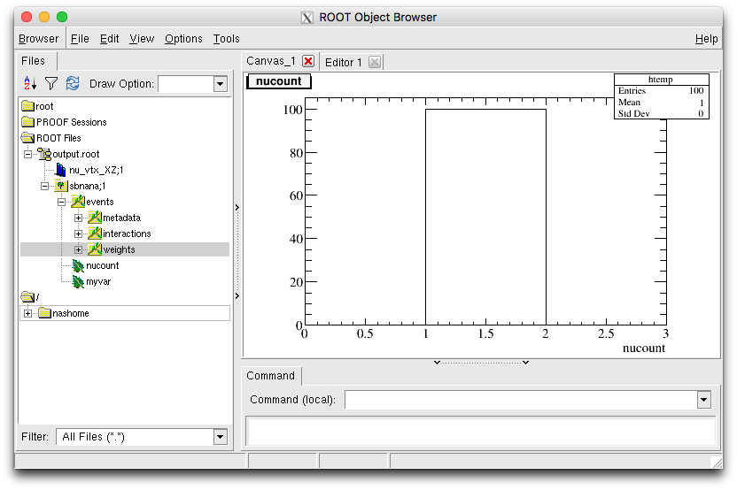
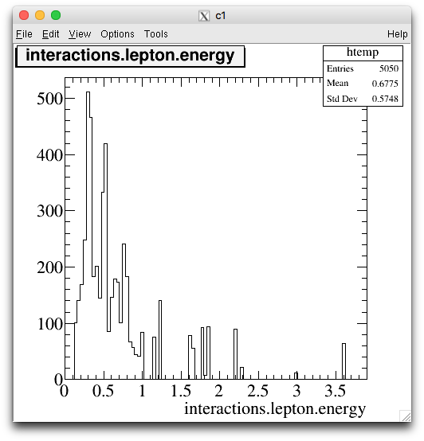

SBN Analysis
============
This package provides a lightweight event analysis and fitting framework for
measurements within the the Short-Baseline Neutrino program at Fermilab.

It is built on [gallery](http://art.fnal.gov/gallery/), a library designed
for reading [art](http://art.fnal.gov) ROOT files.

Analysis code is stored in subdirectories of `ana`, with one directory per
analysis. Common core code for event I/O is in `io`, and shared utilities
in `util`.

### Processors

The fundamental piece of analysis code is a `Processor`, which operates on
gallery events and writes an output tree. A processor can add additional
branches to the tree, or save any other desired objects to the output
file. Configuration parameters may be passed to a processor using a
JSON file.

One runs a processor by calling a framework-wide binary, like this:

    sbn -c CONFIG.json MyAnalysis_MySelection INPUT1.root INPUT2.root

Building
--------
The build process is managed by [CMake](https://cmake.org). A number of
dependencies are required to read art ROOT files, which are most easily
configured using [ups](https://cdcvs.fnal.gov/redmine/projects/ups/wiki).

For example, to configure an environment for reading SBND files on a
host with SBND CVMFS access:

    source /cvmfs/sbnd.opensciencegrid.org/products/sbnd/setup_sbnd.sh
    setup sbndcode v06_65_00 -q e14:prof
    setup gallery v1_06_04 -q e14:prof:nu
    setup cmake v3_9_0
    setup jsoncpp v1_7_7a -q e14:prof

Note: In the future an `sbncode` UPS product will automatically set up
the dependencies to read files for any SBN experiment.

To build the software:

    mkdir build && cd build  # A directory for build products
    cmake ..  # Configure the build system
    make install  # Build

The `cmake` command accepts many useful options. For example:

* `-DCMAKE_INSTALL_PREFIX=/some/path`: Install the software at  `/some/path`.
  The default is to install inside the build directory.
* `-DCMAKE_BUILD_TYPE=Debug`: Build with debugging flags enabled (i.e. `-g`)

Final binaries are placed in the `bin` directory and libraries in `lib`.

Tutorial
--------
A primary goal of this package is to centralize development of event selection
code and fitting frameworks, and establish a standard analysis tree format
that is compatible with all fitters. As such, the fundamental object in
`sbnanalysis` is an event processor class which writes a standard ROOT tree,
plus additional user-specified data.

### A Selection Analysis ###
Analysis code is stored in subdirectories of `ana`, one per analysis. These
directories contain any utility code and algorithms, and a selection class
which is a subclass of `core::SelectionBase`. Note that all code should
should be defined inside a namespace `ana::NameOfAnalysis`.

The selection code must define the following methods:

* `void Initialize(Json::Value* config)`: Load configuration parameters and
  perform analysis-specific setup, such as defining histograms, and adding
  custom branches to the output tree.

* `void Finalize()`: Perform analysis-specific tear-down, such as computing
  statistics and writing histograms to the output file.

* `void ProcessEvent(gallery::Event& ev)`: Perform the event-level analysis,
  such as filling histograms and setting the variables corresponding to the
  custom branches (they will filled -- written to the tree --  automatically).

The user is free to add arbitrary branches to the default output ROOT tree,
using the method `void AddBranch(std::string name, T* object)` where the first
argument is the branch name and the second is a refernce to the object, which
shold be a member variable of the user's selection class.

Note that `Initialize` (`Finalize`) is called after the after (before) the base
selection class setup and teardown, so you have access to the ROOT output file
and the output tree in these methods.

As an example, a selection subclass might look like this:

```c++
namespace ana {
  namespace ExampleAnalysis {

class ExampleSelection : public core::SelectionBase {
public:
  ExampleSelection();
  void Initialize();
  void Finalize();
  void ProcessEvent(gallery::Event& ev);

protected:
  int fMyVar;  // For a custom branch
};
```

with an implementation like:

```c++
#include <iostream>
#include "gallery/ValidHandle.h"
#include "ExampleSelection.h"

namespace ana {
  namespace ExampleAnalysis {
    // Constructor
    ExampleSelection::ExampleSelection() : SelectionBase() {}

    // Setup
    void ExampleSelection::Initialize() {
      AddBranch("myvar", &fMyVar);  // Define a custom branch
    }

    // Teardown
    void ExampleSelection::Finalize() {}

    // Event processing
    void ExampleSelection::ProcessEvent(gallery::Event& ev) {
      // ... Process the gallery::Event ...
      fMyVar = 42;  // Fill in the custom branch
    }
  }  // namespace ExampleAnalysis
}  // namespace ana

// Important!: Declare the selection to sbnanalysis.
DECLARE_SBN_PROCESSOR(ana::ExampleAnalysis::ExampleSelection)
```

Note that the final `DECLARE_SBN_PROCESSOR` line is required to run the code
within the sbnanalysis framework.

Finally, new source code must be added to the library definitions in the
`CMakeLists.txt` file within the analysis subdirectory. See the provided
`ExampleAnalysis` for an example.

### Running the Analysis

The analysis code is run over a set of files using a framework-level
executable:

    sbn PROCESSOR -c CONFIGURATION INPUT_DEFINITION

    PROCESSOR - Name of processor, typically AnalysisName_SelectionName
    CONFIGURATION - Configuration file
    INPUT_DEFINITION - Input files (see note)

The configuration file contains settings which are passed to the selection
processor's `Initialize` function.

The input files can be defined as a ROOT file (ending in .root), a
SAM definition (no extension), or a file list (any other extension).

To run the above example (after building):

    sbn ExampleAnalysis_ExampleSelection input.root

### Analyzing the Output

The output file is a ROOT file with a tree named `sbnana` plus any additional
objects written by the selection code. The `sbnana` tree contains a branch
called `events`; this is the standard event-level information written out
by all processors, stored in an `Event` object. See `core/Event.hh` for the
complete definition.

To read the output files in ROOT, one must load the event dictionary, which
is stored in `libsbnanalysis_Processor.so`. Compiled code should link to this
library, and on the ROOT command line one can run:

    .L lib/libsbnanalysis_Processor.so

Now, we can open the file in a `TBrowser`:



One can make plots interactively, or analyze this tree with a ROOT macro or
script. For example, in the ROOT console:

    root [0] .L lib/libsbnanalysis_Processor.so
    root [1] TFile f("output.root")
    root [2] sbnana->Draw("interactions.lepton.energy")

This will produce a plot of the primary lepton energies for all neutrino
interactions:



Examples
--------
A complete example analysis package is provided in `ana/ExampleAnalysis`.

Authors
-------
* A. Mastbaum, UChicago
* G. Putnam, UChicago
* J. Zennamo, UChicago
* D. Schmitz, UChicago
* *Your name here!*

License
-------
This package is licensed under an MIT license. See `LICENSE.txt` for details.

