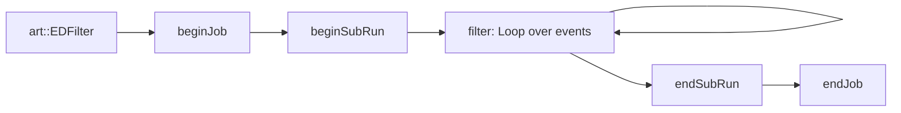
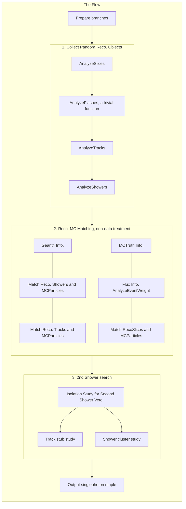
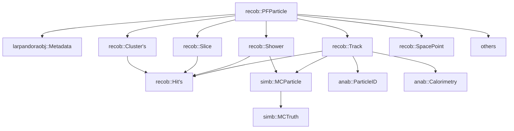

# SinglePhotonAnalysis Module 
Ported from `ubana` in suite `uboonecode v08_00_00_43 e17:prof` in Mar. 2022

The original code can be found at [Fermilab Readmine](https://cdcvs.fnal.gov/redmine/projects/ubana/repository?utf8=%E2%9C%93&rev=feature%2Fmarkross_Nov2021_merge)

The SinglePhotonAnalysis Module is originally developed in MicroBooNE that aids [NCDeltaRadiative singlephoton search](https://arxiv.org/abs/2110.00409).

* [Quick Start](#quick-start)
* [Update Log](#update-log)
* [Overview](#overview)
* [Glossary](#glossary)

---
## Quick Start
Use a reco2 stage artROOT file as input:
```
lar -c run_singlephoton_sbnd.fcl -s <input_reco2_sbnd_artROOT>
```

## Update Log
The module does not work out of the box, so there are some modifications to make it fit into the SBND.

- June 2022
	- New electric gains for SBND MC at `singlephoton_sbnd.fcl`, see SBN-doc-19505-v1;
	- Update the neutrino slice definition in the `Single Photon` module.
	- Update on geometry variables such as, `reco_*_dist_to_CathodePlane`
	- Disable Kalman dEdx variables
	- Disable Second Shower Search 3D (`sss3d`) variables
	- Update FHiCLs for filtering events in SBND: `NCRadiativeResonant` and `NCDeltaRadiative`

These updates are to accommodate the change of Pandora features listed below:

### Pandora features updates
|Items|Pandora @ MicroBooNE|Pandora @ SBND|
|---|---|---|
|Neutrino Slice|One nu slice in each event | Multiple nu slices in each event|
|Kalman Fitter| In-use | Not in-use|
|3dShowers Objects| Available | Unavailable|
|MVA Method (for track/neutrino scores)|Support Vector Machines|Boosted Decision Trees|


---
## Overview

Three sub-modules are included in the Single Photon Analysis Module:
- `SinglePhoton_module.cc` impements the `SinglePhoton` module to read reco2 files and produce n-tuples with varaibles targeting photon reconstructions.
- `NCRadiativeResonant_module.cc`  implements the `NCRadiativeResonant` filter to select events with photons coming out from the nucleus.
- `NCDeltaRadiative_module.cc` implements the `NCDeltaRadiative` filter for NCDeltaRadiative events

### File Structure
- `Libraries/` contains essential headers for the `SinglePhoton` module.

- `SEAview/` is an additional module runs inside the `SinglePhoton` module.

- `jobs/` contains FHiCL files for running these modules

- `HelperFunctions/` contains some useful functions to simplify the code

Header goes like


### The flow of the `SinglePhoton` module

The main flow


In each event loop:



### Pandora Dependency
Objects are obtained from Pandora reconstruction, and they are connected with the following relation:



These objects are accessible via labels:

Labels configured in `singlephoton_sbnd.fcl`
|Alias|Objects|Label|
|---|---|---|
|PandoraLabel|`std::vector<recob::PFParticle>`<br>`std::vector<recob::Cluster>`<br>`std::vector<recob::Slice>`<br>`std::vector<recob::Vertex>`|pandora|
|TrackLabel|`std::vector<recob::Track>`|pandoraTrack|
|ShowerLabel|`std::vector<recob::Shower>`|pandoraShower|
|ParticleIDLabel|`anab::ParticleID`(`art::FindOneP`)|pandoraSCEPid|
|CaloLabel|`anab::Calorimetry`(`art::FindManyP`)|pandoraSCECalo|
|FlashLabel|`std::vector<recob::OpFlash>`|opflashtpc0|
|POTLabel|`sumdata::POTSummary`|generator|

Below alias auto-configured inside the code as a default
|Alias|Objects|Label|
|---|---|---|
|HitFinderModule|`std::vector<recob::Hit>`|gaushit|
|BadChannelLabel|`std::vector<int>`|badmasks(REMOVED)|
|ShowerTrackFitter|`art::Assns<recob::PFParticle,recob::Track,void>`|pandoraTrack|
|ShowerTrackFitterCalo|`anab::Calorimetry`(`art::FindManyP`)|pandoraCalo|
|GeneratorLabel|`std::vector<simb::GTruth>`<br>`std::vector<simb::MCTruth>`|generator|
|GeantModule|`simb::MCParticle>`(`art::FindManyP`)|largeant|
|HitMCParticleAssnLabel|`simb::MCParticle,anab::BackTrackerHitMatchingData`<br>(`art::FindManyP`)|gaushitTruthMatch|
|Shower3DLabel|`recob::Shower`(`art::FindOneP`)|pandoraShower|


---
## Glossary

### Parameters in FHiCL
Summarization in progress.

### Output Variables

In `TTree vertex_tree`, variables prefix have the following meaning:
- Reconstructed variables valid for all types of events
	- `reco_*` are reconstructed variables provided by Pandora
	- `sss_*` are second shower search varaibles targeting hits/clusters that are not considered as tracks or showers by Pandora
	- `trackstub_*` are track stub varaibles targeting track-like hits/clusters that are not considered as tracks or showers by Pandora
- MC variables from simulations
	- `mctruth_*` are MCTruth variables provided by the event genrator GEANT4
	- `sim_*` are MCTruth variables matched to Pandora reconstructed objects
